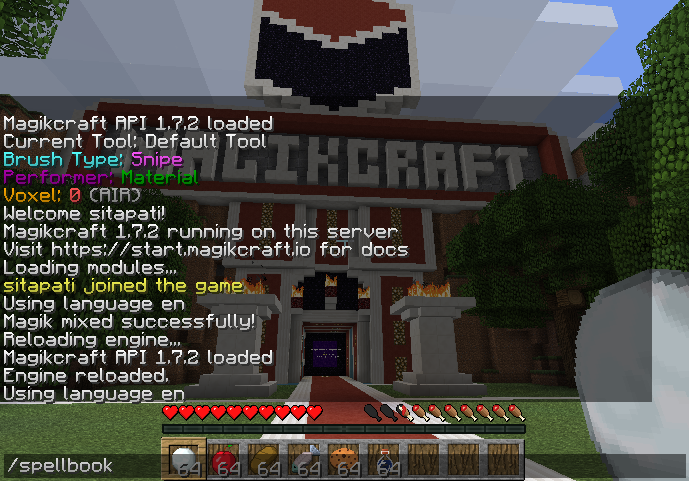

# What you need to use Magikcraft

You need a few things to use Magikcraft. Don't worry, we'll go through each one and explain how to get it.

# Pre-requisites

To use Magikcraft, you will need the following:

 1. A computer with one of: Mac OS (Apple), Microsoft Windows, or a Linux Operating System.
 2. The Google Chrome web browser.
 3. A Minecraft.net account.
 4. A Minecraft Java edition (PC & Mac) license.
 5. A Minecraft client.
 6. A GitHub account.

## Computer with Mac, Windows, or Linux OS

You need a computer with a keyboard to program. Magikcraft only runs on computers with the Mac OS, Microsoft Windows, or a Linux OS like Ubuntu.

You can't use an iPad or other tablet with Magikcraft.

## The Google Chrome web browser

Google Chrome is a free web browser that you can download from [Google](https://www.google.com/chrome/browser/desktop/index.html).

We know that Magikcraft works with the latest version of Google Chrome, and we do all of our testing on new releases of Google Chrome. We don't guarantee that it will work with any other browser.

## A Minecraft account

Go to [minecraft.net](https://minecraft.net), where you can create a free Minecraft account. You'll need this to login to Minecraft, and also to purchase the Minecraft Java edition for PC & Mac.

## A Minecraft Java edition (PC & Mac) license

There are a number of different Minecraft editions. There is pocket edition for the iPad / iPhone, Minecraft Windows 10 edition, Minecraft Education Edition, and the Minecraft Java (PC & Mac) edition.

The edition that you need is the Minecraft Java (PC & Mac) edition. It is the one that is offered for purchase on the front page of [minecraft.net](https://minecraft.net).

In January, 2018, it cost AU$35. That's thirty-five Australian dollars. It's a one-time purchase. Once you buy it, you can use it for life.

## A Minecraft Client

Once you purchase the Minecraft Java edition (PC & Mac), you can download the Minecraft client from [minecraft.net](https://www.minecraft.net).

## A GitHub account

A GitHub account is necessary for coding in Magikcraft. A GitHub account is free to get, and takes a couple of minutes.

GitHub is an online platform for software development. It has done for open source software development what Facebook did for photo sharing and instant messaging - put it all in one place with a single login. We use GitHub with Magikcraft to introduce kids immediately to open source software development. After they master the basics of coding, we show them the code they have written on GitHub, and they then start to explore and learn from Magikcraft code written by other kids on GitHub.

### Get a GitHub account

Here’s how to get a GitHub account:

1. Go to [www.github.com](https://www.github.com).
2. Pick a username. I recommend using the same username as your Minecraft username.
3. Enter your email address.
4. Enter a new password.
5. Click on "Sign up for GitHub”.

6. Leave it set to the free plan (the default).

7. Check your inbox for the confirmation email from GitHub (check the spam folder as well).
8. Click on the confirmation link to confirm the account.
9. You do not need to do the GitHub tutorial that pops up. You can if you want, but these are all the steps that are needed for Magikcraft.

It is important to confirm the account via the confirmation email, because only confirmed GitHub accounts can be used with Magikcraft.

Some users have reported issues receiving the confirmation email. From what we've seen, outlook.com mailboxes seem to have an issue. You can work around this by using another email provider, such as Gmail, for your confirmation email address.

# Setup

OK, now you need to do some configuration.

## Log in to Spellbook

The Magikcraft Spellbook is where you craft magik spells (computer programs) to use in Magikcraft.

You need to authorise the Magikcraft Spellbook with your GitHub account. The Magikcraft Spellbook uses your GitHub account for two things:

1. To authorise you to your Magikcraft Spellbook.
2. To save your spells in a GitHub repository in your account.

To authorise your Magikcraft Spellbook with your GitHub account:

1. Go to [play.magikcraft.io](https://play.magikcraft.io).
2. Click on the button that says "LOG IN WITH GITHUB".

You are now asked to log in to GitHub, if you are not already logged in. Your password for GitHub is not stored or seen by Magikcraft. At this point you are logging in to the GitHub website itself. If you are already logged in to GitHub in this web browser, then you will skip this step and go straight to the next one.

3. Enter your GitHub username and password to log in to GitHub.

Once you login to GitHub, you are asked to authorise the Magikcraft Login with GitHub. This allows the Magikcraft Spellbook to know that it is you. We use GitHub as our identity provider. Your GitHub account is the proof of your identity in Magikcraft.

4. Authorise the Magikcraft Spellbook with your GitHub account.

You are now logged in to the Spellbook, and you see the "Connect to Minecraft" instructions.

Now you can use these instructions to log in to Minecraft.

## Log in to Minecraft

OK, so you need to have a Minecraft client for this.

### Download Minecraft client

You can use the standard Minecraft.net client. If you got a Minecraft account and bought the license for the Java edition (PC & Mac), then you can log in to Minecraft.net and download it.

1. Login to [Minecraft.net](https://www.minecraft.net).
2. Click on the Download link.

3. Click the big green Download button.

### Create Magikcraft profile

Once you have Minecraft installed, you need to create a profile that matches the Magikcraft servers.

As of January, 2018, Magikcraft servers use 1.11.2.

You only need to create a launch profile once. After that, you use the launch profile.

To create a new profile:

1. Start the Minecraft client
2. Log in with your Minecraft.net user name and password

3. Click on Launch Options

4. Click on the "Add New" button.

5. Fill in the details for the new profile. Select _release 1.11.2_ for Version, and click "Save".

6. Click the "News" link to go back to the main screen of the launcher.

7. Click the `^` arrow beside the Play button to select the Profile to load, and select the Magikcraft profile that you created.

8. Click on the "Play" button.

9. When the Minecraft launcher loads, click on "Multiplayer".

10. The first time you do this, you need to add the Magikcraft server. To do this, click "Add Server"

11. Enter the details for the Magikcraft server.

12. Click "Done".

13. You can now select Magikcraft from the Multiplayer servers list. Click the `|>` button. This will connect you to the server.

## Connect your Minecraft account to your spellbook

This is the final step in the setup.

You will connect your Minecraft account with your GitHub account in this step.

When you connect to the Magikcraft server, you will appear in the lobby.

1. Type the following: `/spellbook`. The `/` key causes a terminal to appear at the bottom of the screen.

2. When you press the `Enter` (or `Return`) key, you see a message:
`Press 'T' and click the line below:`. Press the `T` key on your keyboard (or `/` if that doesn't work). This will open a terminal, and give you a mouse cursor.

3. Click on the line that starts with `http://play.magikcraft.io/?c=...`. This will do one of two things - open the link in your browser, or give you a confirmation screen like the following:

4. If you get the confirmation screen, click on "Copy to Clipboard", then go to Google Chrome and paste it in to the location box at the top.

5. Your spellbook will open and connect with your Minecraft username.

### Things that can go wrong

If Google Chrome is not your default web browser, then the link may open in another web browser like Safari or Internet Explorer.

In this case, you have two workarounds:

1. You can set Google Chrome as your default web browser.
2. If you get the confirmation screen, you can copy the link to the clipboard and then paste it into Google Chrome.
3. You can manually type the link into Google Chrome, copying it from Minecraft. The link must be _exactly_ the same, including capitals. The part after the `?c=` is important. It is your unique API Key and identifies you.
